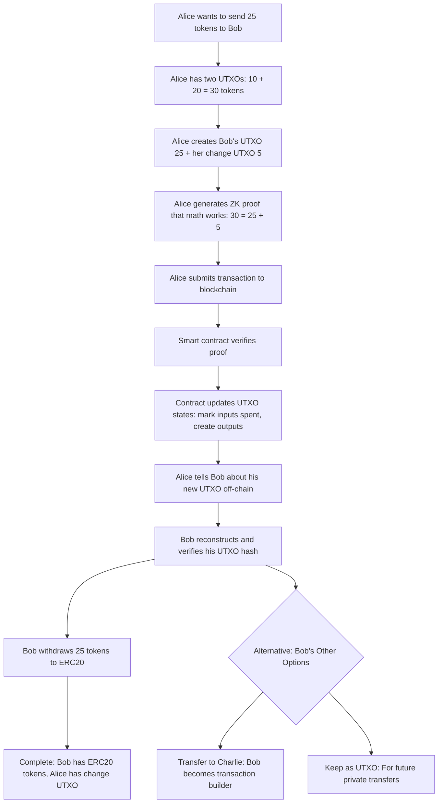

# Zeto: Zero-Knowledge Privacy Token System
### Complete Technical Guide & Quick Start

---

## Table of Contents
1. [Introduction & Core Concepts](#introduction--core-concepts)
2. [Architecture Overview](#architecture-overview)
3. [Understanding UTXOs in Practice](#understanding-utxos-in-practice)
4. [Privacy Levels Explained](#privacy-levels-explained)
5. [Quick Start Guide](#quick-start-guide)
6. [Demo Walkthroughs](#demo-walkthroughs)
7. [zkDvP: Decentralized Trading](#zkdvp-decentralized-trading)
8. [Security & Trust Model](#security--trust-model)
9. [Deployment Guide](#deployment-guide)
10. [Advanced Topics](#advanced-topics)

---

## Introduction & Core Concepts

### What is Zeto?

Zeto is a privacy-preserving token system that enables anonymous transactions using zero-knowledge proofs (zkSNARKs). Unlike traditional blockchain tokens where all transaction amounts and participants are public, Zeto allows for:

- **Anonymous transfers**: Transaction participants remain private
- **Encrypted amounts**: Token values can be hidden from public view
- **Double-spend protection**: Cryptographic guarantees prevent token reuse
- **Regulatory compliance**: Optional KYC integration without sacrificing privacy

### The UTXO Model

Zeto uses an **Unspent Transaction Output (UTXO)** model, similar to Bitcoin but with privacy enhancements:

```typescript
interface UTXO {
  value: number;        // Token amount
  hash: BigInt;         // Public identifier
  salt: BigInt;         // Random value for uniqueness
  owner: User;          // Private owner information
}
```

**Key Insight**: The smart contract only sees `hash` values, never the actual `value` or `owner` information.

### How Privacy Works

1. **UTXO Creation**: `hash = poseidon(value, salt, owner_pubkey)`
2. **Contract Storage**: Only the hash is stored on-chain
3. **Zero-Knowledge Proofs**: Prove ownership without revealing details
4. **Reconstruction**: Recipients can verify they own a UTXO by recalculating its hash

---

## Architecture Overview

### Who Does What in the System

Before diving into technical details, let's understand the three main players:

1. **Users (Alice, Bob)** - Create transactions and manage UTXOs
2. **Smart Contracts** - Validate transactions and track UTXO states
3. **Zero-Knowledge Proofs** - Prove transactions are valid without revealing details

### The Flow of a Transaction



### Smart Contract Architecture

```solidity
// Core UTXO tracking - contract only sees hashes!
mapping(uint256 => UTXOStatus) internal _utxos;

enum UTXOStatus {
    UNKNOWN,  // 0 - doesn't exist yet
    UNSPENT,  // 1 - available for spending
    SPENT     // 2 - already consumed
}

// Example of what the contract sees:
// _utxos[888222333444] = UTXOStatus.UNSPENT
// _utxos[777333444555] = UTXOStatus.SPENT
```

**Key Insight**: The contract never knows who owns what or how much - it only tracks hash statuses!

### Privacy Guarantees

| **What's Hidden from Contract** | **What's Public on Blockchain** |
|--------------------------------|----------------------------------|
| Token amounts (500, 300, 200) | UTXO hashes (888222333444) |
| Owner identities (Alice, Bob) | Transaction timing |
| Transaction relationships | Proof validity |
| Account balances | Gas costs |

---

## Understanding UTXOs in Practice

When Alice wants to send tokens to Bob, **Alice creates Bob's UTXO herself**. 

This is totally different from normal banking where you just say "send money to Bob" and the bank handles it.

Think of it like this: Alice is both the customer AND the cashier making change.

### UTXO Creation Process

```typescript
// 1. Generate cryptographic identity
const Alice = await newUser(alice_signer);
// newUser() generates BabyJub keypair from Ethereum signer for zero-knowledge circuit compatibility
// Result: BabyJub keypair for zero-knowledge operations

// 2. Create UTXO with private information
const aliceUTXO = newUTXO(500, Alice);
// newUTXO() generates a random salt and calculates hash = poseidon(value, salt, owner_pubkey[0], owner_pubkey[1])

// 3. Smart contract stores only the hash
await zeto.connect(deployer).mint([aliceUTXO.hash], "0x");
// Contract state: _utxos[hash] = UTXOStatus.UNSPENT
```

### Transfer Mechanism

Let's say Alice wants to send 25 tokens to Bob:

```typescript
// 1. Alice starts with two UTXOs (from previous mint)
utxo1 = newUTXO(10, Alice);   // Alice has 10 tokens
utxo2 = newUTXO(20, Alice);   // Alice has 20 tokens
// Total: 30 tokens

// 2. Alice creates the output UTXOs she wants
const bobUTXO = newUTXO(25, Bob);       // Send 25 to Bob
const aliceChange = newUTXO(5, Alice);  // Keep 5 as change (30 - 25 = 5)

// 3. Alice generates a zero-knowledge proof
const proof = await prepareTransferProof(
  circuit,                    // zkSNARK circuit
  provingKey,                // Proving key
  Alice,                     // Signer (proves ownership)
  [utxo1, utxo2],           // Alice's inputs (10 + 20 = 30)
  [bobUTXO, aliceChange],   // Alice's outputs (25 + 5 = 30)
  [Bob, Alice]              // Recipients
);

// 4. Alice submits the transaction
await zeto.transfer(
  [utxo1.hash, utxo2.hash],           // Input commitments (to be spent)
  [bobUTXO.hash, aliceChange.hash],   // Output commitments (to be created)
  proof.encodedProof,                 // Zero-knowledge proof
  "0x"                                // Additional data
);
```

**Key Insight**: Alice builds the entire transaction, including Bob's UTXO, and proves the math is correct (inputs = outputs).

### How Bob Confirms Receipt

After Alice's transaction succeeds, here's how Bob knows he received tokens:

```typescript
// 1. Bob gets the transaction events from the blockchain
const events = parseUTXOEvents(zeto, transferReceipt);
const incomingUTXOs = events[0].outputs;  // [bobUTXO.hash, aliceChange.hash]

// 2. Alice tells Bob the UTXO details (off-chain communication)
// In basic mode: Alice sends Bob a message with the details
const messageFromAlice = {
  receivedValue: 25,
  receivedSalt: bobUTXO.salt,  // The salt Alice used when creating Bob's UTXO
  utxoIndex: 0                 // Which output in the transaction is Bob's
};

// 3. Bob reconstructs the UTXO hash to verify it's really for him
const reconstructedHash = poseidonHash([
  BigInt(25),                    // Amount Alice told him
  bobUTXO.salt,                  // Salt Alice told him  
  Bob.babyJubPublicKey[0],       // Bob's public key
  Bob.babyJubPublicKey[1]        // Bob's public key
]);

// 4. Bob checks if his calculation matches what's on the blockchain
if (reconstructedHash === incomingUTXOs[0]) {
  console.log("✅ I received 25 tokens from Alice!");
  // Bob can now create a new UTXO object for future spending
  const bobReceivedUTXO = newUTXO(25, Bob, bobUTXO.salt);
} else {
  console.log("❌ Hash mismatch - this UTXO is not for me");
}
```

**UTXO transfers summary:**

1. **Alice has**: Two UTXOs (10 tokens + 20 tokens = 30 total)
2. **Bob needs**: 25 tokens
3. **Alice spends**: Both her UTXOs (30 tokens total)
4. **Alice creates**: 25 tokens for Bob + 5 change for herself
5. **Alice proves**: The math works (30 = 25 + 5)

---

## Privacy Levels Explained

### Available Token Types

| Token Name | Privacy Level | Features | Circuit Power |
|------------|---------------|----------|---------------|
| `Zeto_Anon` | **Basic** | Anonymous transfers, public amounts | 12 |
| `Zeto_AnonNullifier` | **Secure** | + Double-spend protection | 16 |
| `Zeto_AnonEnc` | **Encrypted** | + Hidden amounts | 14 |
| `Zeto_AnonEncNullifier` | **Maximum** | + All features combined | 16 |
| `Zeto_AnonEncNullifierKyc` | **Compliant** | + KYC integration | 16 |

### Level 1: Basic Anonymous (`Zeto_Anon`)

**Features:**
- Anonymous participant identities
- Public transaction amounts
- Simple UTXO model

**Use Cases:**
- Learning and development
- Applications where amounts can be public
- High-performance requirements

**Trade-offs:**
- ✅ Fastest proof generation (~200ms)
- ✅ Lowest gas costs
- ❌ No double-spend protection
- ❌ Amounts are visible

### Level 2: Secure Anonymous (`Zeto_AnonNullifier`)

**Features:**
- Anonymous participant identities
- Public transaction amounts
- Nullifier-based double-spend protection

**Use Cases:**
- Production applications
- Financial systems requiring integrity
- Regulatory environments

**Trade-offs:**
- ✅ Double-spend protection
- ✅ Moderate performance
- ❌ Amounts still visible
- ❌ Requires Merkle tree management

### Level 3: Maximum Privacy (`Zeto_AnonEncNullifier`)

**Features:**
- Anonymous participant identities
- Encrypted transaction amounts
- Nullifier-based double-spend protection
- Merkle tree inclusion proofs

**Use Cases:**
- High-value transfers
- Regulatory compliance
- Maximum privacy requirements

**Trade-offs:**
- ✅ Complete privacy
- ✅ Full security guarantees
- ❌ Slower proof generation (~2000ms)
- ❌ Higher gas costs
- ❌ Complex implementation

---

## Quick Start Guide

### Prerequisites

```bash
# Install dependencies
npm install

# Ensure you have a Besu network running (or use provided config)
# Gas price should be 0 for testing
```

### 1. Deploy Core Contracts

```bash
# Deploy ERC20 token (for deposits/withdrawals)
npx hardhat ignition deploy ignition/modules/erc20.ts --network btp

# Deploy Zeto tokens (choose privacy level)
npx hardhat ignition deploy ignition/modules/zeto_anon.ts --network btp
# or for maximum privacy
npx hardhat ignition deploy ignition/modules/zeto_anon_enc_nullifier.ts --network btp
```


### 2. Run Basic Demo

```bash
# Test basic anonymous transfers
npx hardhat run scripts/zeto-anon-demo.ts --network btp
```

### 3. Run Advanced Demo

```bash
# Test encrypted transfers with nullifiers
npx hardhat run scripts/zeto-anon-enc-nullifier-demo.ts --network btp
```

### 4. Deploy zkDvP (Optional)

```bash
# Deploy complete trading system (includes payment & asset tokens + zkDvP)
npx hardhat ignition deploy ignition/modules/main.ts --network btp
```

---

## Demo Walkthroughs

### Demo 1: Basic Anonymous Transfers

**File**: `scripts/zeto-anon-demo.ts`

This demo demonstrates the fundamental Zeto workflow:

#### Step 1: Identity Generation
```typescript
// Generate cryptographic identities
const Alice = await newUser(alice_signer);
const Bob = await newUser(bob_signer);

// Each user gets:
// - Ethereum signer (for transactions)
// - BabyJub keypair (for zero-knowledge operations)
// - Formatted private key (for circuit compatibility)
```

#### Step 2: UTXO Creation & Deposit
```typescript
// Create UTXO with private information
const aliceUTXO = newUTXO(500, Alice);
console.log(`UTXO Hash: ${aliceUTXO.hash}`);
console.log(`Value: ${aliceUTXO.value} (private)`);

// Deposit ERC20 tokens to get UTXO
await erc20.approve(zeto.address, 500);
const proof = await prepareDepositProof(Alice, aliceUTXO);
await zeto.deposit(500, aliceUTXO.hash, proof);
```

#### Step 3: Anonymous Transfer (Alice Creates Everything)

Alice wants to send tokens to Bob. Here's how it works in the demo:

```typescript
// Alice starts with two UTXOs from the previous mint
utxo1 = newUTXO(10, Alice);   // First UTXO: 10 tokens
utxo2 = newUTXO(20, Alice);   // Second UTXO: 20 tokens
await doMint(zeto, deployer, [utxo1, utxo2]);  // Mint both UTXOs

// Alice creates the transfer outputs
const bobUTXO = newUTXO(25, Bob);       // Send 25 to Bob
const aliceChange = newUTXO(5, Alice);  // Keep 5 as change (30 - 25 = 5)

// Alice generates the transfer proof
const transferProof = await prepareTransferProof(
  circuit,                    // Load the zkSNARK circuit
  provingKey,                // Load the proving key
  Alice,                     // Alice is the signer
  [utxo1, utxo2],           // Alice's inputs (10 + 20 = 30)
  [bobUTXO, aliceChange],   // Alice's outputs (25 + 5 = 30)
  [Bob, Alice]              // Recipients
);

// Alice submits the transaction
const transferTx = await zeto.connect(Alice.signer).transfer(
  [utxo1.hash, utxo2.hash],           // Input commitments to spend
  [bobUTXO.hash, aliceChange.hash],   // Output commitments to create
  transferProof.encodedProof,         // Zero-knowledge proof
  "0x"                                // Additional data
);

console.log("✅ Transfer completed! Gas used:", transferTx.gasUsed);
```

#### Step 4: Communication & UTXO Reconstruction

After the blockchain transaction, here's how Bob confirms he received the tokens:

```typescript
// 1. Bob gets the transaction events from the blockchain
const events = parseUTXOEvents(zeto, transferReceipt);
const incomingUTXOs = events[0].outputs;  // Array of UTXO hashes

// 2. Alice tells Bob the details (off-chain communication)
// "Hey Bob, I sent you 25 tokens. Here are the details:"
const messageFromAlice = {
  receivedValue: 25,
  receivedSalt: bobUTXO.salt,    // Salt Alice used when creating Bob's UTXO
  utxoIndex: 0                   // Bob's UTXO is the first output
};

// 3. Bob reconstructs the UTXO hash to verify
const reconstructedHash = poseidonHash([
  BigInt(25),                    // Amount Alice told him
  bobUTXO.salt,                  // Salt Alice told him
  Bob.babyJubPublicKey[0],       // Bob's public key
  Bob.babyJubPublicKey[1]        // Bob's public key
]);

// 4. Bob verifies the hash matches what's on the blockchain
if (reconstructedHash === incomingUTXOs[0]) {
  console.log("✅ Bob verified: I received 25 tokens from Alice!");
  // Bob can now create a UTXO object for future spending
  const bobReceivedUTXO = newUTXO(25, Bob, bobUTXO.salt);
} else {
  console.log("❌ Hash mismatch - this UTXO is not for me");
}
```


#### Step 5: Bob Withdraws His Tokens (Completing the Flow)

Now that Bob has verified he received the tokens, he can withdraw them to ERC20:

```typescript
// Bob checks his starting ERC20 balance
const bobStartingBalance = await erc20.balanceOf(Bob.ethAddress);
console.log(`Bob's starting ERC20 balance: ${bobStartingBalance}`);

// Bob prepares withdrawal proof for his received UTXO
const { inputCommitments: bobInputs, outputCommitments: bobOutputs, encodedProof: bobProof } =
  await prepareWithdrawProof(Bob, [bobReceivedUTXO, ZERO_UTXO], ZERO_UTXO);

// Bob withdraws his tokens to ERC20
const bobWithdrawTx = await zeto.connect(Bob.signer).withdraw(
  25,                    // Amount Bob received from Alice
  bobInputs,             // Bob's UTXO to spend
  bobOutputs[0],         // No change UTXO needed
  bobProof               // Bob's withdrawal proof
);

console.log(`✅ Bob withdrawal completed! Gas used: ${bobWithdrawTx.gasUsed}`);

// Bob checks his final ERC20 balance
const bobFinalBalance = await erc20.balanceOf(Bob.ethAddress);
console.log(`Bob's final ERC20 balance: ${bobFinalBalance}`);
console.log(`Bob received: ${bobFinalBalance - bobStartingBalance} ERC20 tokens`);
```

### Bob's Options After Receiving Tokens

After Bob confirms receipt of his tokens, he has several options:

**Most Common**: Withdraw to ERC20 (shown in Step 5 above)

**Alternatives**:

#### Alternative 1: Transfer to Someone Else
```typescript
// Bob can now spend his UTXO by transferring to Charlie
const charlieUTXO = newUTXO(20, Charlie);
const bobChange = newUTXO(5, Bob);  // Bob keeps 5 tokens as change

// Bob generates his own transfer proof
const bobTransferProof = await prepareTransferProof(
  circuit,
  provingKey,
  Bob,                              // Bob is now the signer
  [bobReceivedUTXO, ZERO_UTXO],    // Bob's input (25 tokens)
  [charlieUTXO, bobChange],        // Bob's outputs (20 + 5 = 25)
  [Charlie, Bob]                   // Recipients
);

// Bob submits his transfer
await zeto.connect(Bob.signer).transfer(
  [bobReceivedUTXO.hash],
  [charlieUTXO.hash, bobChange.hash],
  bobTransferProof.encodedProof,
  "0x"
);
```

#### Alternative 2: Keep as UTXO for Future Use
```typescript
// Bob can keep the UTXO for future private transfers
// No action needed - Bob just holds onto his bobReceivedUTXO
console.log("Bob keeps his 25 tokens as a private UTXO for future use");

// Later, Bob can use this UTXO in any transfer or withdrawal
// The UTXO remains private and can be spent at any time
```

#### Step 5: Bob Withdraws His Tokens (Completing the Flow)

Now that Bob has verified he received the tokens, he can withdraw them to ERC20:

```typescript
// Bob checks his starting ERC20 balance
const bobStartingBalance = await erc20.balanceOf(Bob.ethAddress);
console.log(`Bob's starting ERC20 balance: ${bobStartingBalance}`);

// Bob prepares withdrawal proof for his received UTXO
const { inputCommitments: bobInputs, outputCommitments: bobOutputs, encodedProof: bobProof } =
  await prepareWithdrawProof(Bob, [bobReceivedUTXO, ZERO_UTXO], ZERO_UTXO);

// Bob withdraws his tokens to ERC20
const bobWithdrawTx = await zeto.connect(Bob.signer).withdraw(
  25,                    // Amount Bob received from Alice
  bobInputs,             // Bob's UTXO to spend
  bobOutputs[0],         // No change UTXO needed
  bobProof               // Bob's withdrawal proof
);

console.log(`✅ Bob withdrawal completed! Gas used: ${bobWithdrawTx.gasUsed}`);

// Bob checks his final ERC20 balance
const bobFinalBalance = await erc20.balanceOf(Bob.ethAddress);
console.log(`Bob's final ERC20 balance: ${bobFinalBalance}`);
console.log(`Bob received: ${bobFinalBalance - bobStartingBalance} ERC20 tokens`);
```

**Key Point**: Bob can spend his received UTXO just like Alice - he becomes the transaction builder for his own transfers or withdrawals.

### Demo 2: Encrypted Transfers with Nullifiers

**File**: `scripts/zeto-anon-enc-nullifier-demo.ts`

This demo shows the most advanced privacy features:

#### Step 1: Enhanced Setup
```typescript
// Initialize Sparse Merkle Trees for UTXO tracking
const smtAlice = new Merkletree(new InMemoryDB(str2Bytes("")), true, 64);
const smtBob = new Merkletree(new InMemoryDB(str2Bytes("")), true, 64);

// Create two UTXOs (circuit requirement)
const aliceUTXO1 = newUTXO(300, Alice);
const aliceUTXO2 = newUTXO(200, Alice);
```

#### Step 2: Merkle Tree Integration
```typescript
// Mint UTXOs to on-chain Merkle tree
await zeto.mint([aliceUTXO1.hash, aliceUTXO2.hash]);

// Synchronize local trees
await smtAlice.add(aliceUTXO1.hash, aliceUTXO1.hash);
await smtAlice.add(aliceUTXO2.hash, aliceUTXO2.hash);
```

#### Step 3: Nullifier Generation
```typescript
// Generate nullifiers for double-spend protection
const nullifier1 = newNullifier(aliceUTXO1, Alice);
const nullifier2 = newNullifier(aliceUTXO2, Alice);

// Each nullifier is unique and tied to Alice's private key
console.log(`Nullifier 1: ${nullifier1.hash}`);
console.log(`Nullifier 2: ${nullifier2.hash}`);
```

#### Step 4: Encrypted Transfer
```typescript
// Create output UTXOs
const bobUTXO = newUTXO(300, Bob);
const aliceChange = newUTXO(200, Alice);

// Generate ephemeral key for ECDH encryption
const ephemeralKeypair = genKeypair();

// Generate merkle proofs for both input UTXOs
const root = await smtAlice.root();
const merkleProof1 = await smtAlice.generateCircomVerifierProof(aliceUTXO1.hash, root);
const merkleProof2 = await smtAlice.generateCircomVerifierProof(aliceUTXO2.hash, root);
const merkleProofs = [
  merkleProof1.siblings.map(s => s.bigInt()),
  merkleProof2.siblings.map(s => s.bigInt())
];

// Generate encrypted transfer proof
const transferProof = await prepareEncryptedTransferProof(
  circuit,                           // anon_enc_nullifier circuit
  provingKey,                       // Proving key
  Alice,                            // Signer
  [aliceUTXO1, aliceUTXO2],        // Input UTXOs
  [nullifier1, nullifier2],        // Nullifiers
  [bobUTXO, aliceChange],          // Output UTXOs
  root.bigInt(),                   // Merkle root
  merkleProofs,                    // Merkle proofs
  [Bob, Alice],                    // Recipients
  ephemeralKeypair.privKey         // Ephemeral key for encryption
);

// Execute encrypted transfer
await zeto.connect(Alice.signer).transfer(
  [nullifier1.hash, nullifier2.hash],  // Nullifiers (prevent double-spend)
  [bobUTXO.hash, aliceChange.hash],     // Output commitments
  root.bigInt(),                        // Merkle root
  transferProof.encryptionNonce,        // Encryption nonce
  ephemeralKeypair.pubKey,              // Ephemeral public key
  transferProof.encryptedValues,        // Encrypted amounts
  transferProof.encodedProof,           // Zero-knowledge proof
  "0x"                                  // Additional data
);
```

#### Step 5: Decryption & Verification
```typescript
// Bob decrypts his received amount using ECDH
const bobSharedKey = genEcdhSharedKey(Bob.babyJubPrivateKey, ephemeralKeypair.pubKey);
const bobDecrypted = poseidonDecrypt(
  transferProof.encryptedValues.slice(0, 4).map(v => BigInt(v)), // First 4 values are Bob's
  bobSharedKey,
  BigInt(transferProof.encryptionNonce),
  3  // length parameter
);

console.log(`Bob decrypted amount: ${bobDecrypted[0]}`);
console.log(`Decryption successful: ${bobDecrypted[0] === BigInt(bobUTXO.value) ? "MATCH" : "MISMATCH"}`);

// Alice decrypts her change amount
const aliceSharedKey = genEcdhSharedKey(Alice.babyJubPrivateKey, ephemeralKeypair.pubKey);
const aliceDecrypted = poseidonDecrypt(
  transferProof.encryptedValues.slice(4, 8).map(v => BigInt(v)), // Next 4 values are Alice's
  aliceSharedKey,
  BigInt(transferProof.encryptionNonce),
  3
);

console.log(`Alice decrypted change: ${aliceDecrypted[0]}`);
```

#### Step 6: Bob's Withdrawal Process (Encrypted Mode)
```typescript
// Bob can withdraw his received UTXO using nullifiers
const bobNullifier = newNullifier(bobReceivedUTXO, Bob);

// Bob generates merkle proof for his UTXO
const bobRoot = await smtBob.root();
const bobMerkleProof = await smtBob.generateCircomVerifierProof(bobReceivedUTXO.hash, bobRoot);

// Bob prepares withdrawal proof
const { nullifiers: bobWithdrawNullifiers, outputCommitments: bobWithdrawOutputs, encodedProof: bobWithdrawProof } = 
  await prepareNullifierWithdrawProof(
    Bob,
    [bobReceivedUTXO, ZERO_UTXO],
    [bobNullifier, ZERO_UTXO],
    ZERO_UTXO,                                            // No change UTXO
    bobRoot.bigInt(),
    [bobMerkleProof.siblings.map(s => s.bigInt()), Array(64).fill(0n)]
  );

// Bob withdraws to ERC20
const bobWithdrawTx = await zeto.connect(Bob.signer).withdraw(
  300,                             // Amount Bob received
  bobWithdrawNullifiers,           // Bob's nullifiers
  bobWithdrawOutputs[0],           // No change output
  bobRoot.bigInt(),                // Merkle root
  bobWithdrawProof                 // Bob's withdrawal proof
);

console.log(`Bob withdrew 300 tokens to ERC20! Gas used: ${bobWithdrawTx.gasUsed}`);
```

---

## zkDvP: Decentralized Trading

### Overview

zkDvP (Zero-Knowledge Delivery vs Payment) enables atomic swaps between different token types while maintaining privacy:

```typescript
// Example: Trade 100 fungible tokens for 1 NFT
const trade = {
  paymentInputs: [fungibleUTXO1, fungibleUTXO2],  // 100 tokens
  paymentOutputs: [bobFungibleUTXO],               // To Bob
  assetInput: aliceNFT,                            // From Alice
  assetOutput: bobNFT                              // To Bob
};
```

### Trading Process

#### 1. Trade Initiation
```typescript
// Alice initiates trade with payment UTXOs
await zkDvP.initiateTrade(
  [utxo1.hash, utxo2.hash],  // Payment inputs
  [bobUTXO.hash, 0],         // Payment outputs
  paymentProofHash,
  0,                         // No asset input
  0,                         // No asset output
  ZeroHash
);
```

#### 2. Trade Acceptance
```typescript
// Bob accepts with asset UTXOs
await zkDvP.acceptTrade(
  tradeId,
  [0, 0],                    // No payment inputs
  [0, 0],                    // No payment outputs
  ZeroHash,
  assetInput.hash,           // Asset input
  assetOutput.hash,          // Asset output
  assetProofHash
);
```

#### 3. Atomic Execution
```typescript
// Both parties submit their proofs
await zkDvP.completeTrade(tradeId, paymentProof);
await zkDvP.completeTrade(tradeId, assetProof);

// Trade executes atomically when both proofs are valid
```
---

## Security & Trust Model

### Cryptographic Foundations

#### Poseidon Hash Function
- **Purpose**: zkSNARK-friendly hashing for UTXO commitments
- **Security**: Collision-resistant, preimage-resistant
- **Efficiency**: Optimized for zero-knowledge circuits

#### Groth16 Zero-Knowledge Proofs
- **Properties**: Succinct, non-interactive, zero-knowledge
- **Verification**: Constant-time verification regardless of statement complexity
- **Soundness**: Computationally infeasible to forge valid proofs

#### BabyJub Elliptic Curve
- **Purpose**: Efficient cryptographic operations in circuits
- **Security**: Discrete logarithm problem hardness
- **Compatibility**: Designed for zkSNARK systems

### Trust Assumptions

#### What You Must Trust:
1. **Circuit Correctness**: The zkSNARK circuits correctly implement the intended logic
2. **Trusted Setup**: The Powers of Tau ceremony was conducted honestly
3. **Cryptographic Primitives**: Hash functions and elliptic curves are secure
4. **Smart Contract Code**: The Solidity implementation is bug-free

#### What You Don't Need to Trust:
1. **Other Users**: Zero-knowledge proofs guarantee correctness
2. **Centralized Authority**: System operates without intermediaries
3. **Network Operators**: Blockchain consensus provides integrity
4. **Privacy Assumptions**: Cryptographic guarantees, not policy

### Threat Model

#### Protected Against:
- **Transaction Graph Analysis**: UTXOs appear as random hashes
- **Amount Disclosure**: Values encrypted in advanced modes
- **Identity Correlation**: Anonymous public keys
- **Double-Spending**: Nullifier-based prevention
- **Proof Forgery**: Cryptographic soundness guarantees

---

## Deployment Guide

### TEST Mode Deployment

TEST mode uses pre-generated zkSNARK parameters for quick deployment:

```bash
# Deploy any Zeto token type
npx hardhat ignition deploy ignition/modules/zeto_anon.ts --network besu
npx hardhat ignition deploy ignition/modules/zeto_anon_enc_nullifier.ts --network besu

# Deploy complete zkDvP system
npx hardhat ignition deploy ignition/modules/main.ts --network besu
```

### PRODUCTION Mode Setup

Production deployment requires a trusted setup ceremony:

#### 1. Generate Powers of Tau
```bash
# Generate universal parameters
node scripts/powers_of_tau/universal-ceremony/initCeremony.js
node scripts/powers_of_tau/universal-ceremony/contribute.js
node scripts/powers_of_tau/universal-ceremony/finalizeCeremony.js
```

#### 2. Circuit-Specific Setup
```bash
# For each circuit (replace with actual circuit name)
node scripts/powers_of_tau/circuit-specific/initPhase2.js anon
node scripts/powers_of_tau/circuit-specific/contribute.js anon
node scripts/powers_of_tau/circuit-specific/finalizePhase2.js anon
```

#### 3. Local Development Setup
```bash
# Quick setup for testing (not for production)
node scripts/generateLocalSetup.js Zeto_Anon 12
```

### Testing

```bash
# Run comprehensive tests
npx hardhat test

# Run specific demos
npx hardhat run scripts/zeto-anon-demo.ts --network besu
npx hardhat run scripts/zeto-anon-enc-nullifier-demo.ts --network besu
```

---

