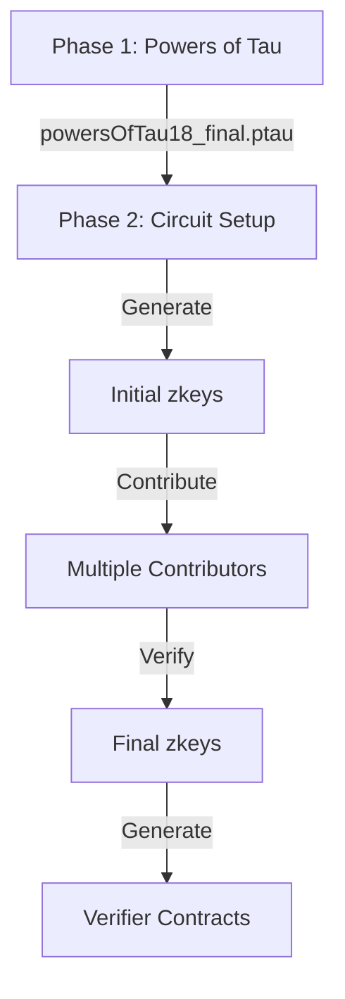

# Complete Guide to Zero-Knowledge Trusted Setup Ceremony

A comprehensive guide for conducting both Phase 1 (Powers of Tau) and Phase 2 (Circuit-Specific) ceremonies for secure zk-SNARK parameter generation.

## Introduction

In zk-SNARKs (Zero-Knowledge Succinct Non-Interactive Arguments of Knowledge), a trusted setup ceremony is required to generate public parameters essential for creating zero-knowledge proofs. This ceremony ensures that no malicious actor can compromise the security by knowing the secret trapdoors used during setup.

### Powers of Tau

The **Powers of Tau** is a universal setup phase that generates parameters independent of any specific circuit. It computes the powers of a secret value (tau), which are later specialized during the circuit-specific setup. This phase requires multiple participants to contribute randomness securely. The security relies on the fact that as long as at least one participant is honest and destroys their secret, the resulting parameters are secure.

### Multi-Party Computation (MPC)

The ceremony leverages **Multi-Party Computation (MPC)** to securely generate the parameters without revealing the secret tau. Each participant contributes their own randomness (entropy), and through MPC, these contributions are combined in such a way that the final output remains secure even if some participants are dishonest. MPC allows multiple parties to compute a function over their inputs while keeping those inputs private, ensuring the integrity and confidentiality of the setup process.

By following this guide, you'll conduct both phases of the trusted setup, ensuring the generated zk-SNARK parameters are secure for production use.

## 1. Roles & Requirements

- **Coordinator**: Manages both ceremonies.
- **Participants**: Minimum 3-5 for Phase 1, at least 3 for Phase 2.
- **Security Level**: Production-grade (power of tau = 18).
- **Circuit Size**: Supports up to 2^18 constraints.

## 2. Directory Structure

```bash
scripts/powers_of_tau/
├── universal-ceremony/        # Phase 1 scripts
├── circuit-specific/          # Phase 2 scripts
├── circuit-specific-output/   # Phase 2 generated files
├── final_setup/               # Final PTAU files
└── verifier/                  # Generated verifiers
```

## 3. Phase 1: Powers of Tau Ceremony

### A. Coordinator Initialization

Navigate to the `universal-ceremony` directory:

```bash
cd scripts/powers_of_tau/universal-ceremony
```

Initialize the ceremony with the desired power (e.g., 18):

```bash
node initCeremony.js 18
```

This creates:

- `universal-ceremony-output/ceremony_0.ptau`

### B. Participant Contributions (Repeat 3-5 times)

For each participant:

1. **Coordinator** sends:

   - `ceremony_N.ptau` (e.g., `ceremony_0.ptau`)

2. **Participant** navigates to the `universal-ceremony` directory and runs:

   ```bash
   node contribute.js
   ```

   The script will automatically detect the latest `.ptau` file and generate the next contribution.

3. **Participant** returns to the coordinator:

   - `ceremony_N+1.ptau`
   - `ceremony_N+1_info.json` (Response Hash)

### C. Coordinator Verification

After receiving each contribution, the coordinator verifies it:

```bash
node verifyContribution.js ceremony_N+1.ptau
```

### D. Phase 1 Finalization

Finalize the ceremony:

```bash
node finalizeCeremony.js ceremony_final.ptau 18
```

This generates:

- `final_setup/powersOfTau18_final.ptau`

## 4. Phase 2: Circuit-Specific Setup

### A. Initialize Circuit Setup

Navigate to the `circuit-specific` directory:

```bash
cd scripts/powers_of_tau/circuit-specific
```

Initialize Phase 2 for the desired token (e.g., `Zeto_Anon`):

```bash
node initPhase2.js ../final_setup/powersOfTau18_final.ptau Zeto_Anon
```

This creates, for each circuit:

- `circuit-specific-output/<circuit>/<circuit>_0000.zkey`
- `circuit-specific-output/<circuit>/setup_info.json`

### B. Circuit Contributions (Minimum 3 per circuit)

For each participant and each circuit:

1. **Participant** navigates to the `circuit-specific` directory and runs:

   ```bash
   node contribute.js Zeto_Anon
   ```

   The script will automatically contribute to all circuits associated with `Zeto_Anon`.

2. **Participant** returns the updated `.zkey` files and corresponding `_info.json` files.

3. **Coordinator** verifies each contribution:

   ```bash
   node verifyPhase2.js <circuit> <latestZkeyFile>
   ```

### C. Finalize Each Circuit

For each circuit, finalize Phase 2:

```bash
node finalizePhase2.js <circuit> <latestZkeyFile>
```

This generates:

- Final `.zkey` file
- Verification key
- Solidity verifier contract

## 5. Security Requirements

### Phase 1

- **Power of Tau**: Set to 18 for production.
- **Contributors**: Minimum of 3-5 independent contributors.
- **Machines**: Use different machines for each contribution.
- **Entropy Sources**: Secure and independent entropy sources.
- **Verification**: Verify all contribution hashes.
- **Random Beacon**: Apply during finalization.

### Phase 2

- **Contributors per Circuit**: Minimum of 3.
- **Entropy**: Independent entropy per contribution.
- **Verification**: Verify between transfers.
- **File Distribution**: Secure methods for sharing files.
- **Audit Trail**: Maintain a complete log of all actions.

## 6. File Flow



## 7. Production Checklist

- [ ] **Phase 1**: Minimum 3-5 contributors.
- [ ] **Phase 2**: Minimum 3 contributors per circuit.
- [ ] **Verification**: All contributions verified.
- [ ] **Random Beacon**: Applied during finalization.
- [ ] **Verifiers**: Contracts generated.
- [ ] **Documentation**: All hashes and steps documented.
- [ ] **Backup**: All artifacts securely backed up.
- [ ] **Logs**: Ceremony logs secured.

## 8. Required External Files

1. **Circuit R1CS Files**: Located in:

   ```
   test/libs/proving-keys/*.r1cs
   ```

2. **Circuit Mapping**: Located in:

   ```javascript
   // scripts/circuitsMap.js
   {
     "Zeto_Anon": [
       "anon",
       "anon_batch",
       "check_hashes_value",
       "check_inputs_outputs_value",
       "check_inputs_outputs_value_batch"
     ]
   }
   ```

## 9. Full Usage Example with Zeto_Anon

### Phase 1: Powers of Tau Ceremony

#### Coordinator Initialization

```bash
cd scripts/powers_of_tau/universal-ceremony
node initCeremony.js 18
```

#### Participant Contributions

For each participant:

1. **Coordinator** shares the latest `ceremony_N.ptau` file.
2. **Participant** runs:

   ```bash
   node contribute.js
   ```

3. **Participant** returns:

   - Updated `ceremony_N+1.ptau`
   - `ceremony_N+1_info.json`

#### Coordinator Verification

```bash
node verifyContribution.js ceremony_N+1.ptau
```

#### Finalization

```bash
node finalizeCeremony.js ceremony_final.ptau 18
```

### Phase 2: Circuit-Specific Setup for Zeto_Anon

#### Initialize Circuit Setup

```bash
cd scripts/powers_of_tau/circuit-specific
node initPhase2.js ../final_setup/powersOfTau18_final.ptau Zeto_Anon
```

#### Participant Contributions

For each participant:

1. **Participant** runs:

   ```bash
   node contribute.js Zeto_Anon
   ```

2. **Participant** returns updated `.zkey` files and `_info.json` files.

#### Coordinator Verification

For each circuit:

```bash
node verifyPhase2.js <circuit> <latestZkeyFile>
```

#### Finalization

For each circuit:

```bash
node finalizePhase2.js <circuit> <latestZkeyFile>
```

This generates:

- Final `.zkey` file
- Verification key
- Verifier contract in `contracts/lib/`

## 10. Using the Scripts Correctly

Ensure you have the correct directory structure and scripts as outlined.

### Script Locations

- **Phase 1 Scripts**: `scripts/powers_of_tau/universal-ceremony/`
  - `initCeremony.js`
  - `contribute.js`
  - `verifyContribution.js`
  - `finalizeCeremony.js`

- **Phase 2 Scripts**: `scripts/powers_of_tau/circuit-specific/`
  - `initPhase2.js`
  - `contribute.js`
  - `verifyPhase2.js`
  - `finalizePhase2.js`

### Running Scripts

- **Phase 1**:
  - Navigate to the `universal-ceremony` directory before running scripts.
  - Use `node initCeremony.js` to initialize the ceremony.
  - Use `node contribute.js` to contribute. The script auto-detects the latest `.ptau` file.
  - Use `node verifyContribution.js <ptauFile>` to verify contributions.
  - Use `node finalizeCeremony.js <lastPtauFile> <power>` to finalize.

- **Phase 2**:
  - Navigate to the `circuit-specific` directory before running scripts.
  - Use `node initPhase2.js <ptauFile> <tokenName>` to initialize circuits.
  - Use `node contribute.js <tokenName>` to contribute to circuits.
  - Use `node verifyPhase2.js <circuit> <zkeyFile>` to verify contributions.
  - Use `node finalizePhase2.js <circuit> <lastZkeyFile>` to finalize.

### Tips

- **Ensure all required external files are in place**: R1CS files, circuit mapping, etc.
- **Scripts auto-detect latest files**: No need to specify file names unless verifying or finalizing.
- **Verification is crucial**: Always verify contributions before proceeding.
- **Maintain clear records**: Document all hashes, contributions, and steps.
